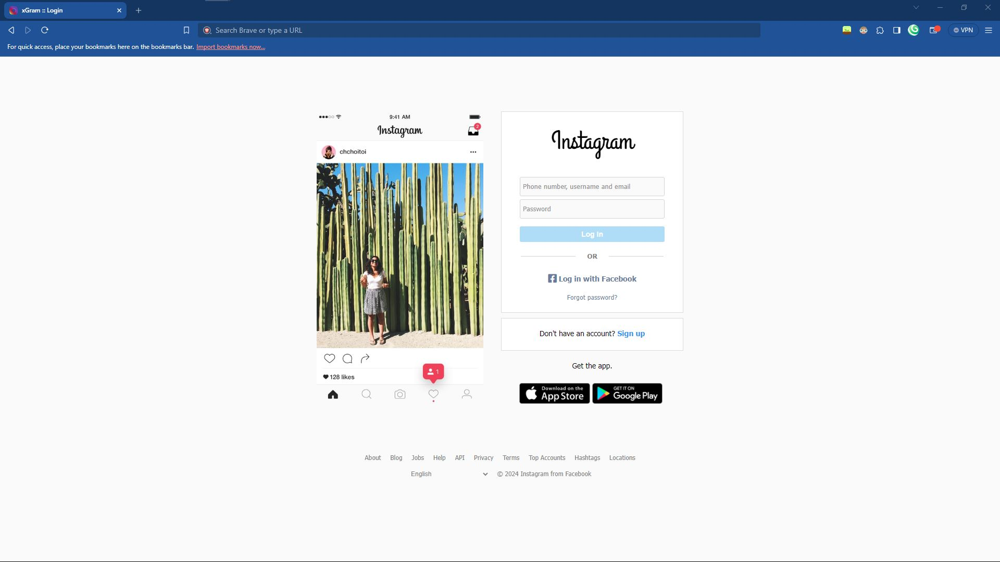
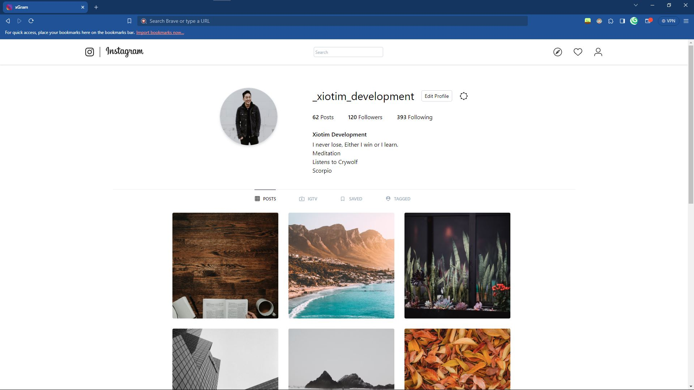

# XGram

**Context:** xSocial is a combination of Facebook and Instageam: turned into one clone.

XGram is now the Instagram clone, alone. Based of 2017-2021 Instagram due to outdated tutorial. This repository is for the both of us; It's a backup for me just in-case my hard-drive fails.

And for you, you can still follow this code espcially if you want to experiment with Tailwind CSS, and SVGs.

**(Thanks FrontendForever!)**

## Acknowledgements

- Originally coded, and shown on  [Frontend Forever](https://www.frontendforever.com/)'s Blog
- A Huge shoutout, to my youngest project as of writing this: [XDT-xSocial](https://github.com/l-xdt/xSocial)
- One of the hugest helps on this project: [DiffCheccker](https://www.diffchecker.com)

## Authors

- [LeidenSchaft Xiotim-Development Team](https://www.github.com/l-xdt)
- [Alvin Maranx, II ツ](https://www.github.com/avun-ai)
- [Frontend Forever](https://www.frontendforever.com/)

## Demo

There is a Demo in this project! And I am still not being inderict, so here is the link: [here](https://l-xdt.github.io/xgram/)

## Features

- Change what you would like to see.

- Posts tailored to what you want to see (on your profile)

- Uses mostly SVG's

- Cross platform (ish)

- **PS:** There is not much here for you to customize, this was just much of a demo project, but you can still have a little fun with it.
  
  ## Screenshots




**Written in Plain HTML, and Tailwind CSS.. there is nothing to explore - very surface-level project**

## Run Locally

Clone the projet and run it on XAMPP

(**PS:** I would recommend still, an alternative domain from localhost, to add to the reality aspect.)

```bash
  git clone https://github.com/l-xdt/xgram
```

Go to the project directory

```bash
  cd xgram
```

Install XAMPP (via Chocalatey, if you don't have it.)

```bash
  chocalatey install xampp
```

Start the server

```bash
    [Directory]/[ServerName]/apache-start.bat
```

**PS:** If you trust your web skills, here is a manual on how to self-host a domain: [here](https://www.youtube.com/watch?v=_eQGAJVtRCs) (by Soeng Song)

## Roadmap

- Additional browser support

- Change what you see on your feed.

- Add as many posts as your want to your profile.

- Change your profile name.

- Have a profile photo: and post photos to your liking.

- Supported on phone, kind of.

- This is all writted by hand: with only **Vanilla** HTML and Tailwind CSS.

- The FavIcon is influenced by the signature: **X**

## Support

For support, reach out to us via either of our emails: [this one](mailto:trowesigames@gmail.com) or [this one](mailto:leidenschaft.tech@gmail.com) or join our Discord Group: which is not up as of writing this readMe.

## Feedback

This still applies to feedback as well, but keep in mind this is a little out-dated. Whether you want to give us positive words or negative ones, sned away! (but please send only constructive-critisism). Send away [here](mailto:trowesigames@gmail.com) or [here](mailto:leidenschaft.tech@hotmail.com).

## FAQ

Now, FAQ..

#### Can I change this in any-way I would like?

Yes, do as you please with this, because it is made for you, community-first even if I am targeting a very small niche with this GitHub Repository.

#### Can I host this, If I can how?

You can, using XAMPP. The one that I have gone into detail many times. A short summary is localhost works by using the IP every computer running Windows and Linux (and some macOS computers) use: 127.0.0.1

So, use whatever you want to host, but I recommend XAMPP. If you need help getting started with it click [here](https://www.youtube.com/watch?v=LzucEZh4_no) (by MainlyWebStuff) ~ To start you off.

And if you are done with that and if you wantchange your domain, click [here](https://www.youtube.com/watch?v=_eQGAJVtRCs) (by Soeng Song)

## Used By

This project is used by the following companies:

- LeidenSchaft-Xiotim Accquisitions (Limited)

- XDT-Studium

- Xiotim Development Team [Limited] (XDT)

- XDT-noHesi

## Related

Here are some related projects:

- [XioTok](https://github.com/l-xdt/xiotok)

- [noHesi](https://github.com/l-xdt/no-hesi)

- [Xirox](https://github.com/l-xdt/xirox)

- [Studium](https://github.com/l-xdt/studium)

- [XioTim](https://github.com/l-xdt/xiotim)

- [XioTube](https://github.com/l-xdt/xiotube)

- [xSocial](https://github.com/l-xdt/xSocial)

## Documentation

- I cannot tell you about all the documentation, so please check out his two tutorials linked below:

- [Login Page](https://www.frontendforever.com/post/123/instagram-clone-v2) by Frontend Forever

- [Profile Page (with Tailwind CSS)](https://www.frontendforever.com/post/121/instagram-clone-tailwind-css) by Frontend Forever

## API Reference

As earlier refrenced, by only saying no APIs used, only one Framework, in this project, otherwise I will update this readMe.
